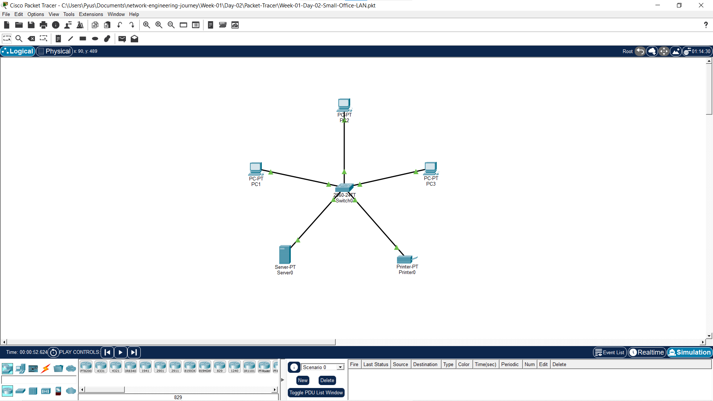
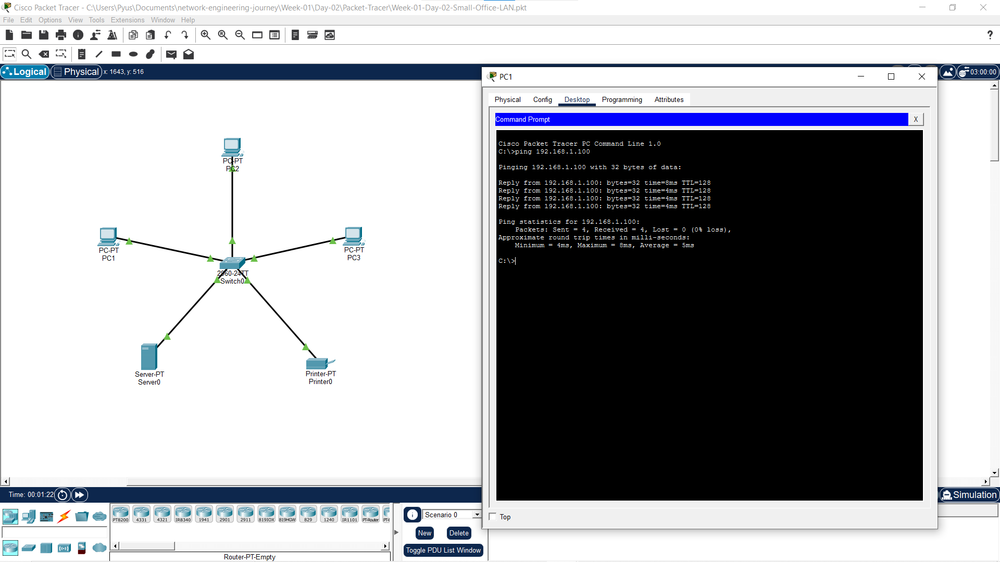

# 🌐 Week 01 — Networking Fundamentals

Welcome to the **Week 01 Comprehensive Summary** of my Network Engineering Journey. This document synthesizes all theoretical knowledge, operational models, practical hands-on labs, visual topology artifacts, and reflections accumulated throughout Week 1.

---

## 📌 Executive Summary & Objectives

Week 01 established the core foundations of computer networking—moving from high-level concepts down to physical frame transmission, network core mechanics, protocol suites, and addressing structures.

### Key Learning Objectives Achieved:
* ✅ Defined computer networks, host roles, intermediary devices, and transmission media.
* ✅ Differentiated major network geographic scopes: **PAN**, **LAN**, **MAN**, and **WAN**.
* ✅ Built and configured a functional Local Area Network (LAN) in Cisco Packet Tracer.
* ✅ Explained network core operations: **Packet Switching** vs **Circuit Switching**.
* ✅ Calculated packet transmission delays using the **Store-and-Forward ($L/R$)** formula.
* ✅ Analyzed queuing delays, output buffer behavior, and packet loss conditions.
* ✅ Traced the 5-step **Domain Name System (DNS)** hierarchical resolution process.
* ✅ Deconstructed 48-bit **MAC addresses** (Layer 2) vs logical **IP addresses** (Layer 3).
* ✅ Mastered **Communication Protocols**, protocol stacks, and **Data Encapsulation**.

---

## 📅 Week 01 Schedule & Progress Matrix

| Day | Topic | Key Focus Areas | Status |
| --- | --- | --- | --- |
| **Day 1** | [Introduction to Networking](Day-01/README.md) | PAN/LAN/MAN/WAN, 5 Main Components, Packet Tracer Intro | ✅ Completed |
| **Day 2** | [Network Components & Small Office LAN](Day-02/README.md) | Physical vs Logical connectivity, Small Office LAN Lab, Ping test | ✅ Completed |
| **Day 3** | [How Frames Move Around a Network](Day-03/README.md) | Packet Switching, $L/R$ Delay, Queuing/Loss, FDM/TDM, DNS, MACs | ✅ Completed |
| **Day 4** | [Communication Protocols & Stacks](Day-04/README.md) | Protocol Syntax/Semantics, TCP/IP Suite, Ethernet, IP, ICMP, DNS | ✅ Completed |

---

## 📚 Comprehensive Technical Synthesis

### Module 1: Network Fundamentals & Device Roles
* **Definition:** A computer network is a mesh of interconnected end systems, intermediary devices, and transmission links that exchange data using standardized protocols.
* **Network Scopes:**
  * **PAN (Personal Area Network):** Short-range (~10m), e.g., Bluetooth earbuds to smartphone.
  * **LAN (Local Area Network):** High-speed, local geographic scope (home, office, building).
  * **MAN (Metropolitan Area Network):** City-wide network infrastructure.
  * **WAN (Wide Area Network):** Connects LANs across vast distances, countries, or globally (the Internet).
* **The 5 Core Components of Any Network:**
  1. *End Devices (Hosts):* Clients, Servers, PCs, Smartphones, Printers.
  2. *Intermediary Devices:* Switches, Routers, Firewalls, Wireless Access Points.
  3. *Transmission Media:* UTP Copper Ethernet cables, Fiber Optics, Wireless RF.
  4. *Services:* Web (HTTP), Email (SMTP), File Storage, Cloud applications.
  5. *Protocols:* Standardized rules governing communication timing, formatting, and delivery.

---

### Module 2: Logical vs Physical Connectivity & Practical Setup
* **Physical Connectivity:** Having intact, compatible cabling (e.g., Straight-Through Cat6) or wireless links properly terminating into NIC ports.
* **Logical Connectivity:** Proper software network configuration including valid IP addressing, matching subnet masks, and default gateway definitions.
* **Connectivity Verification:** Utilizing **ICMP Echo Request/Reply** (`ping`) to verify end-to-end IP reachability.

---

### Module 3: Network Core Mechanics & Data Movement

#### 1. Packet Switching vs. Circuit Switching

```text
               NETWORK CORE ARCHITECTURES
                         │
        ┌────────────────┴────────────────┐
        ▼                                 ▼
 PACKET SWITCHING                 CIRCUIT SWITCHING
 ────────────────                 ─────────────────
 • Dynamic bandwidth sharing       • Reserved resources per session
 • No pre-reservation             • Guaranteed rate & zero queuing delay
 • Best-effort delivery           • Wasteful during idle/silent periods
 • Used by the Internet           • Used by traditional telephony (PSTN)
```

#### 2. Multiplexing in Circuit Switching
* **FDM (Frequency-Division Multiplexing):** Link spectrum is split into distinct frequency bands assigned to separate channels.
* **TDM (Time-Division Multiplexing):** Transmission time is divided into revolving frames with dedicated time slots per user session.

#### 3. Store-and-Forward Transmission Delay Formula
Packet switches must receive the **entire packet** before transmitting the first bit onto the outbound link.

$$\text{Transmission Delay} = \frac{L}{R}$$

* $L$ = Packet size in bits
* $R$ = Link transmission rate in bits per second (bps)

*Example:* A 1,000-bit packet over a 1 Mbps (1,000,000 bps) link takes:
$$\text{Delay} = \frac{1,000}{1,000,000} = 0.001\text{ s} = 1\text{ ms per hop}$$

#### 4. Queuing Delays & Packet Loss
Each outbound switch port has an **output buffer (queue)**.
* **Queuing Delay:** Variable delay caused when arriving packets wait in line while the outbound link is busy transmitting another packet.
* **Packet Loss:** Occurs when the output buffer is completely full upon packet arrival, forcing the switch/router to drop either the incoming packet or an existing queued packet.

#### 5. Forwarding Tables & Routing Protocols
* **Forwarding:** Routers examine the destination IP in the packet header, match it against their internal **Forwarding Table**, and push the packet out the designated interface.
* **Routing Protocols:** Dynamically calculate optimal paths across the topology and populate forwarding tables.

---

### Module 4: Addressing Systems — Layer 2 vs Layer 3

```
┌─────────────────────────┬─────────────────────────────────────────────────┐
│ Feature                 │ MAC Address (Layer 2)                           │ IP Address (Layer 3)                           │
├─────────────────────────┼─────────────────────────────────────────────────┼────────────────────────────────────────────────┤
│ Scope                   │ Local Area Network (LAN)                        │ Global Inter-network                           │
│ Device Handler          │ Switches                                        │ Routers                                        │
│ Burned-In/Dynamic       │ Burned into NIC hardware (Permanent)             │ Assigned dynamically (DHCP) or statically      │
│ Address Size            │ 48 bits (6 Bytes / 12 Hex digits)                │ 32 bits (IPv4) / 128 bits (IPv6)               │
│ Structure               │ 24-bit OUI (Vendor) + 24-bit Device Identifier  │ Hierarchical Network ID + Host ID              │
└─────────────────────────┴─────────────────────────────────────────────────┴────────────────────────────────────────────────┘
```

* **MAC Address Formats by Vendor:**
  * **Cisco IOS:** `aabb.ccdd.eeff` (3 groups of 4 hex digits)
  * **Linux / macOS:** `aa:bb:cc:dd:ee:ff` (6 groups of 2 hex digits with colons)
  * **Windows:** `AA-BB-CC-DD-EE-FF` (6 groups of 2 hex digits with dashes)
* **MAC Transmission Types:**
  * **Unicast:** Frame addressed to a single specific host NIC.
  * **Multicast:** Frame addressed to a specific registered protocol group.
  * **Broadcast:** Frame addressed to all local devices on the LAN (`FF:FF:FF:FF:FF:FF`).

---

### Module 5: Domain Name System (DNS) Query Hierarchy

```text
Browser / Application
        │
        ▼
 1. Local Cache Check (Browser / OS Memory)
        │ (Miss)
        ▼
 2. Recursive Resolver (ISP / 8.8.8.8)
        │ (Miss)
        ▼
 3. Root Name Server (.)
        │ (Directs to TLD)
        ▼
 4. TLD Name Server (.com, .net, .org)
        │ (Directs to Authoritative)
        ▼
 5. Authoritative Name Server (Holds actual IP record)
```

---

### Module 6: Communication Protocols & Protocol Stacks

* **Definition:** A system of rules governing syntax (data format), semantics (field meanings), synchronization (timing), and error recovery.
* **The TCP/IP Protocol Stack & Encapsulation Hierarchy:**

```text
Layer                  Protocol Examples           PDU Name
─────────────────────────────────────────────────────────────────
Application (Layer 7)  DNS, HTTP, HTTPS, SSH       Data
Transport (Layer 4)    TCP, UDP                    Segment / Datagram
Internet (Layer 3)     IP, ICMP                    Packet
Network Access (L2/L1) Ethernet, Wi-Fi             Frame / Bits
```

* **Encapsulation Sequence:** Data is wrapped with layer headers as it travels down the stack:
  $$\text{Data} \xrightarrow{\text{Add Transport Header}} \text{Segment} \xrightarrow{\text{Add IP Header}} \text{Packet} \xrightarrow{\text{Add Eth Header/Trailer}} \text{Frame}$$

---

## 🛠️ Practical Labs & Visual Artifacts Catalog

During Week 1, hands-on Packet Tracer labs and visual verifications were documented:

### Lab Summary Table

| Day | Lab Title | Primary Artifact | Status |
| --- | --- | --- | --- |
| **Day 1** | Packet Tracer Workspace & Device Placement | [Week-01-Day-01-Basic-Workspace.pkt](Day-01/PacketTracer/Week-01-Day-01-Basic-Workspace.pkt) | ✅ Verified |
| **Day 2** | Small Office LAN Configuration & Ping Test | [Week-01-Day-02-Small-Office-LAN.pkt](Day-02/Packet-Tracer/Week-01-Day-02-Small-Office-LAN.pkt) | ✅ Verified |
| **Day 3** | Network Core & Packet Flow Analysis | [Day-03 Packet Tracer Folder](Day-03/Packet-Tracer/README.md) | ⏳ Theory Completed |
| **Day 4** | Protocol Stack & Encapsulation Review | [Day-04 Notes & Protocols](Day-04/Notes/Day-04-Communication-Protocols.md) | ✅ Verified |

---

### Visual Evidence & Diagrams

#### 1. Small Office LAN Topology (Day 2)
The Small Office LAN topology built in Cisco Packet Tracer connects PC clients to a central switch and server:



*Lab Topology Reference: [Week-01-Day-02-Small-Office-LAN.pkt](Day-02/Packet-Tracer/Week-01-Day-02-Small-Office-LAN.pkt)*

---

#### 2. ICMP Echo Ping Verification (Day 2)
Empirical command-line verification showing successful ICMP echo requests and replies between hosts:



*Detailed Lab Notes: [Day-02 Lab-Notes.md](Day-02/Lab-Notes.md)*

---

## 📂 Complete File & Folder Index

All notes, reflections, and lab files for Week 1 are organized logically:

```text
Week-01/
├── README.md                                           ← (You are here) Master Week 1 Summary
├── Day-01/
│   ├── README.md                                       ← Day 1 Overview
│   ├── Reflection.md                                   ← Day 1 Reflection
│   ├── Notes/
│   │   └── Day-01-Introduction-to-Networking.md        ← Day 1 Lesson Notes
│   └── PacketTracer/
│       └── Week-01-Day-01-Basic-Workspace.pkt          ← Day 1 Packet Tracer File
├── Day-02/
│   ├── README.md                                       ← Day 2 Overview
│   ├── Reflection.md                                   ← Day 2 Reflection
│   ├── Lab-Notes.md                                    ← Day 2 Detailed Lab Notes
│   ├── Packet-Tracer/
│   │   └── Week-01-Day-02-Small-Office-LAN.pkt        ← Day 2 Packet Tracer File
│   └── images/
│       ├── Week-01-Day-02-Small-Office-LAN.png        ← Network Topology Diagram
│       └── Server-Ping.png                             ← Ping Verification Screenshot
├── Day-03/
│   ├── README.md                                       ← Day 3 Overview
│   ├── Reflection.md                                   ← Day 3 Reflection
│   ├── Notes/
│   │   └── Day-03-How-Frames-Move-Around-a-Network.md  ← Day 3 Lesson Notes
│   ├── Packet-Tracer/
│   │   └── README.md                                   ← Day 3 Lab Folder
│   └── images/
│       └── README.md                                   ← Day 3 Image Folder
└── Day-04/
    ├── README.md                                       ← Day 4 Overview
    ├── Reflection.md                                   ← Day 4 Reflection
    ├── notes.md                                        ← Day 4 Quick Reference
    ├── Notes/
    │   └── Day-04-Communication-Protocols.md           ← Day 4 Lesson Notes
    ├── Packet-Tracer/
    │   └── README.md                                   ← Day 4 Lab Folder
    └── images/
        └── README.md                                   ← Day 4 Image Folder
```

---

## 💡 Key Lessons & Weekly Reflection

Looking back at Week 1:
1. **Networks are Layered Systems:** Nothing happens in isolation. A simple web browser request relies on DNS for name resolution, IP for global routing, Ethernet for local frame delivery, and physical media for bit transmission.
2. **Hands-On Verification Matters:** Seeing IP addresses and ping outputs in Packet Tracer bridged the gap between reading textbook definitions and observing operational networking behavior.
3. **Engineering Thinking:** Learning formulas like $L/R$ delay and deconstructing buffer overflow conditions taught me to analyze network performance quantitatively rather than conceptually.

---

## 🎯 CCNA Exam Readiness Checklist — Week 1

* [x] Compare IPv4 address types and Layer 2 MAC addresses.
* [x] Describe the impact of network infrastructure components (Switches, Routers, NICs).
* [x] Explain packet switching concepts: Store-and-forward, queuing delays, buffer overflows.
* [x] Identify MAC address formats (Cisco, Windows, Linux) and MAC types (Unicast, Multicast, Broadcast).
* [x] Trace DNS resolution sequence from client cache to Authoritative Server.
* [x] Understand protocol stacks, standards bodies (IETF, IEEE), and encapsulation stages.

---

## 🚀 Transition to Week 2

With Week 1 completed (100%), the foundation is set. In **Week 2**, we will dive deeper into:
* Deep-dive TCP/IP model & OSI 7-Layer reference model comparisons
* Ethernet framing details (Preamble, SFD, EtherType, FCS trailer)
* Transport layer mechanics: TCP (handshake, windowing) vs UDP
* Advanced DNS resolution & diagnostic tools
